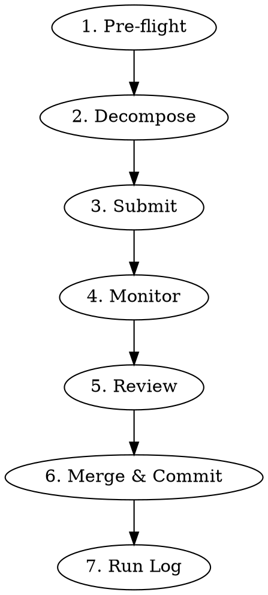

# Swarm Dev Workflow

End-to-end workflow for implementing features via the SwarmAssistant agent swarm.
The gatekeeper (Claude Code session) decomposes work, submits tasks, monitors,
reviews output, and merges.

## Quick Reference

| Step | Command / Action |
|------|-----------------|
| Health check | `curl http://127.0.0.1:5080/healthz` |
| Submit task | `POST http://127.0.0.1:5080/a2a/tasks` with `{"title","description","runId?"}` |
| Create run | `POST http://127.0.0.1:5080/runs` with `{"title"}` |
| Monitor SSE | `curl -N http://127.0.0.1:5080/ag-ui/events` |
| Poll tasks | `curl http://127.0.0.1:5080/a2a/tasks` |
| Task detail | `curl http://127.0.0.1:5080/a2a/tasks/{taskId}` |
| Run detail | `curl http://127.0.0.1:5080/runs/{runId}` |
| Run tasks | `curl http://127.0.0.1:5080/runs/{runId}/tasks` |

## Workflow



### 1. Pre-flight

Verify the runtime is running and healthy before submitting tasks.

```bash
# Check runtime health
curl -s http://127.0.0.1:5080/healthz
# Expected: 200 OK

# Check for active tasks (avoid collision)
curl -s http://127.0.0.1:5080/a2a/tasks | python3 -c \
  'import json,sys; t=json.load(sys.stdin); active=[x for x in t if x.get("status") not in ("done","failed","blocked")]; print(f"{len(active)} active tasks")'
```

If runtime is not running, start it:

```bash
# Option A: Direct (dogfood profile enables worktree isolation)
DOTNET_ENVIRONMENT=Dogfood dotnet run \
  --project project/dotnet/src/SwarmAssistant.Runtime \
  --no-launch-profile

# Option B: Full stack via Aspire
task run:aspire
```

**Important:** Use `DOTNET_ENVIRONMENT=Dogfood` for worktree isolation per task.

### 2. Decompose

Read the design doc (RFC/PRD) and decompose into well-scoped tasks.

**Task granularity guidelines:**
- One concern per task (e.g., "add endpoint" and "add tests" can be one task, but
  "add endpoint" and "write OpenAPI spec" should be separate)
- Implementation + tests bundled together works better than separate tasks
- Keep tasks independent — avoid requiring output of one task as input to another
- Each task description must be self-contained (include file paths, method signatures,
  expected behavior)

**What makes a good task description:**
- Specific file paths to modify
- Method signatures or type definitions expected
- Reference to existing patterns in the codebase
- Clear acceptance criteria

**What makes a bad task description:**
- Vague ("improve the thing")
- Requires reading other task output
- Multiple unrelated concerns
- No file path hints

### 3. Submit

Create a run (optional, groups tasks), then submit tasks.

```bash
# Create a run (optional — groups related tasks)
curl -X POST http://127.0.0.1:5080/runs \
  -H 'Content-Type: application/json' \
  -d '{"title":"rfc-014-run-orchestration"}'
# Returns: {"runId":"...","title":"...","createdAt":"..."}

# Submit a task (with or without runId)
curl -X POST http://127.0.0.1:5080/a2a/tasks \
  -H 'Content-Type: application/json' \
  -d '{
    "title": "Add MergeTaskBranchAsync to WorkspaceBranchManager",
    "description": "Add MergeTaskBranchAsync(string taskId, string targetBranch) method...",
    "runId": "run-abc123"
  }'
# Returns: 202 with {"taskId":"..."}
```

Record each `taskId` — you'll need them for monitoring and review.

### 4. Monitor

Watch task progress via SSE or polling.

```bash
# Live SSE stream (best for real-time monitoring)
curl -N http://127.0.0.1:5080/ag-ui/events

# Poll all tasks
curl -s http://127.0.0.1:5080/a2a/tasks

# Poll specific task
curl -s http://127.0.0.1:5080/a2a/tasks/{taskId}
```

**Key events to watch:**
| Event | Meaning |
|-------|---------|
| `agui.task.submitted` | Task dispatched to pipeline |
| `agui.task.transition` | Role transition (planner -> builder -> reviewer) |
| `agui.task.decision` | Reviewer verdict |
| `agui.task.done` | Task completed |
| `agui.task.failed` | Task failed — check error field |

**Timeout:** If a task shows no transition for >5 minutes, it may be stuck.
Check adapter health and consider cancelling via `cancel_task` AG-UI action.

**Wait for all tasks to reach terminal state** (`done`, `failed`, or `blocked`)
before proceeding to review.

### 5. Gatekeeper Review

Review each completed task's swarm branch (`swarm/task-{id}`).

**Review checklist:**

1. **Build & test first:**
   ```bash
   dotnet test project/dotnet/SwarmAssistant.sln --verbosity quiet
   ```

2. **Spec-vs-code consistency** (swarm's #1 failure pattern):
   - Field nullability matches between DTO, JSON schema, and OpenAPI
   - Required arrays match non-nullable DTO properties
   - Enum/param values consistent across code and spec

3. **Known swarm failure patterns:**
   | Pattern | What to look for |
   |---------|-----------------|
   | CS0854 expression tree | Optional params in actor constructors used in `Props.Create(() => new Actor(...))` |
   | HttpClient lifetime | Singleton storing `HttpClient` from factory — should store `IHttpClientFactory` |
   | Missing feature gate | DI registrations not gated behind feature flags |
   | Scope validation mismatch | Tests using values that strict validation rejects |

4. **Generated models** (if OpenAPI/schema changed):
   ```bash
   task models:verify
   task models:generate  # if stale
   ```

5. **Pre-commit hooks:**
   ```bash
   pre-commit run --all-files
   ```

### 6. Merge & Commit

Apply minimal gatekeeper fixes, then commit with attribution.

```bash
# Commit with swarm + gatekeeper attribution
git commit -m "feat(<scope>): <what was built>

Swarm-produced (planner->builder->reviewer pipeline):
- <bullet list of swarm contributions>

Gatekeeper fixes (Claude Code review):
- <bullet list of corrections>"
```

**Important:** The gatekeeper applies targeted fixes, not rewrites.
If the swarm output needs major rework, the task was poorly scoped — re-submit.

### 7. Run Log

Create a run log at `docs/dogfooding/runs/YYYY-MM-DD-<slug>.md` using the
template in `docs/dogfooding/run-playbook.md#required-run-metadata`.

Key fields: date, adapter order, tasks submitted (taskId + title + final state),
observations, gatekeeper fixes, retro (what went well / what didn't / action items).

## Common Mistakes

| Mistake | Fix |
|---------|-----|
| Not checking runtime health first | Always `curl /healthz` before submitting |
| Vague task descriptions | Include file paths, method signatures, acceptance criteria |
| Submitting dependent tasks | Keep tasks independent; submit sequentially if needed |
| Rewriting swarm output | Apply targeted fixes only; re-submit if fundamentally wrong |
| Forgetting run log | Always create run log — it feeds the retro cycle |
| Running without Dogfood profile | Use `DOTNET_ENVIRONMENT=Dogfood` for worktree isolation |
| Using `cd` in Bash | Always use absolute paths — `cd` breaks `.agent/hooks/pre_tool_use.py` |

## Escalation

If a task fails (`agui.task.failed`):

1. Fetch task snapshot: `curl http://127.0.0.1:5080/a2a/tasks/{taskId}`
2. Check the `error` field for root cause
3. If adapter issue: check CLI adapter health, restart runtime if needed
4. If recoverable: retry via `approve_review` AG-UI action
5. If not recoverable: open GitHub issue with run log + task snapshot

See `docs/dogfooding/run-playbook.md#escalation-handling` for full escalation ladder.
